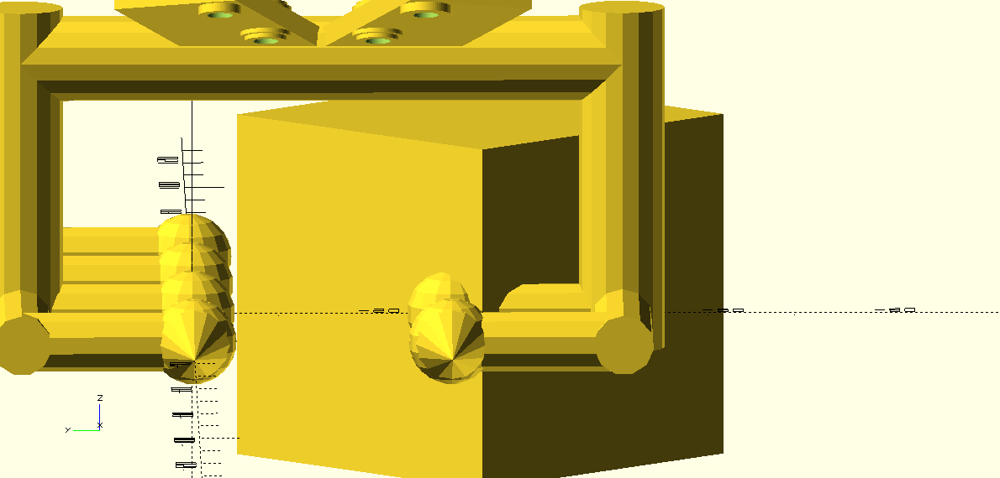
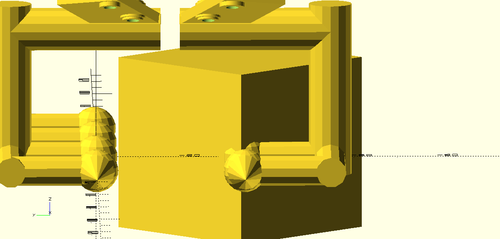
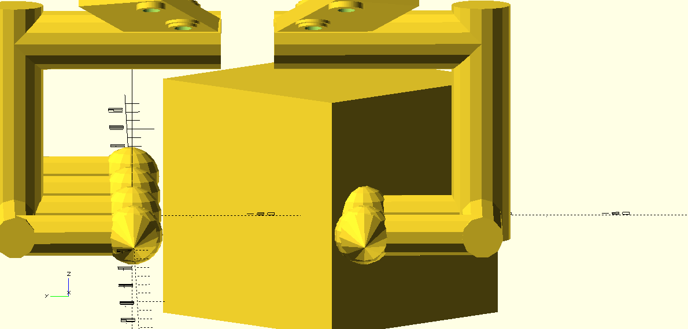
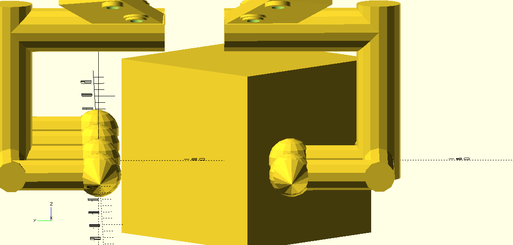
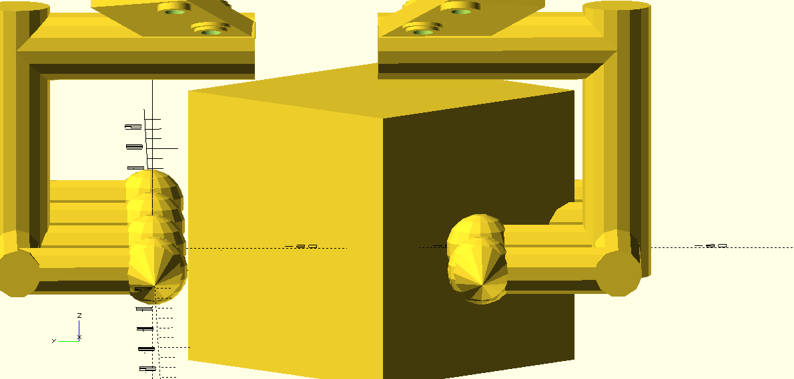
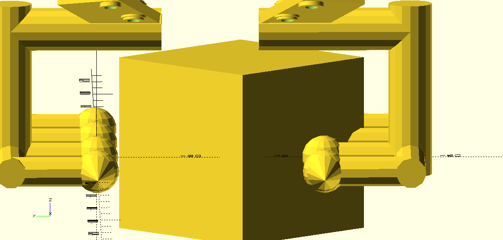
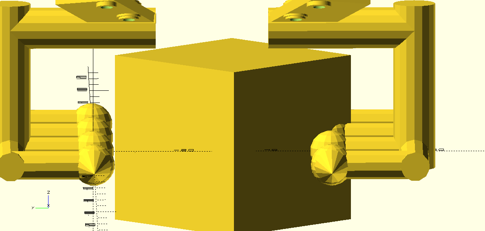
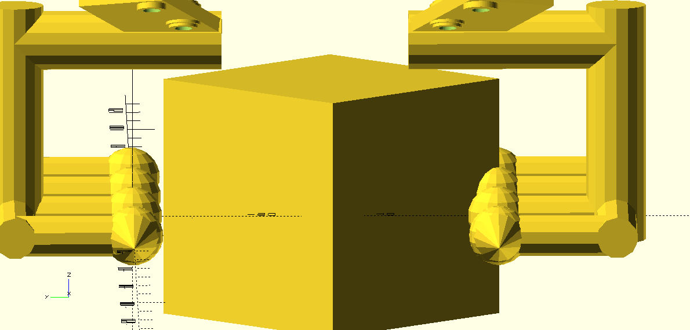
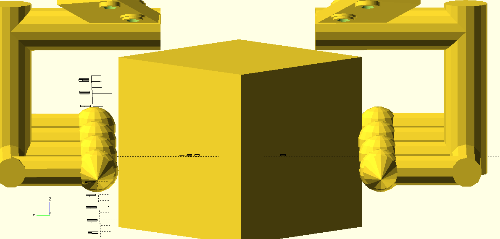
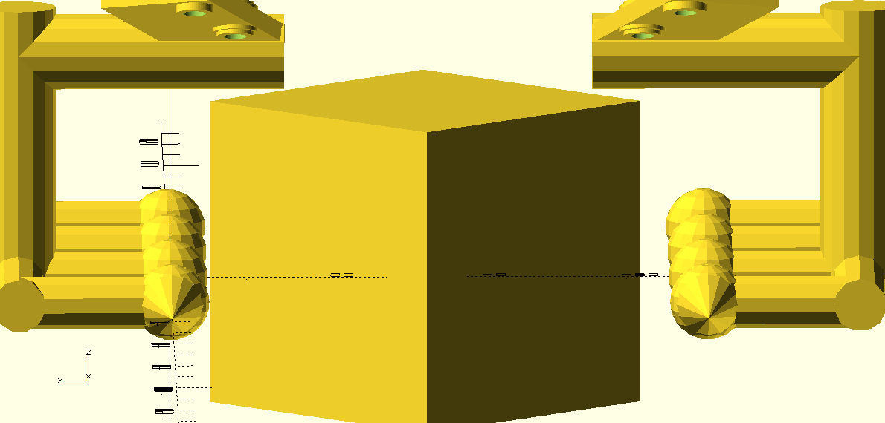

# Simulace1
Kostka  bude uchycená podélné.
Test podélné manipulace při kostce podélné.
Optika je 2D kvůli názornosti.

# Rozteč 0,0mm
Nereálné stavy.
 

# Rozteč 4,5mm
 

# Rozteč 9,0mm
 

# Rozteč 13,5mm
 

# Rozteč 18,0mm
Od 18mm možná manipulace... (Simulace3)
 

# Rozteč 22,5mm
 

# Rozteč 27,0mm
 

# Rozteč 31,5mm
 

# Rozteč 36,0mm
Pohyb s kostkou na šikmo pro menší rozteč není ideální.
 

# Rozteč 40,5mm
 
