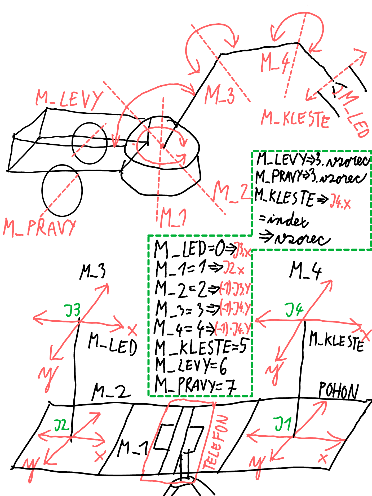

# Ovladač
Jde o zařízení s možností ovládat všech osm motorů tak, aby to zvládal jeden člověk.

## Zapojení
Použil jsem levné Arduino joysticky. Úrovně napětí bude snímat BluePill a posílat data do telefonu přes USB.

## Komunikace
Přes USB pomoci Seriálové linky. V telefoně v Chrome bude tyto data přijímaný přepočítávany a posílána do robota jako pokyny sliderů.
https://developer.chrome.com/articles/usb/

## Koncept
Pochopil jsem, že nejlepší bude vyrobit pákový joystick v rámci kterého bude ještě jeden joystick pro prst.
Pravý Pákovy = Pohon.
- levý motor = vzorec zatím nevyvinut.
- pravý motor = vzorec zatím nevyvinut.

Levý Pákovy = Rameno.
- M1 = osa x.
- M2 = osa y.

Levý Horní = Rameno.
- LED = osa x.
- M3 = osa y.

Levý Horní = Rameno.
- Kleste = osa x.
- M4 = osa y.
    

## Jednotka joysticku

## Modul pro telefon

## Rychloupínák na stativ
https://www.tripodhead.com/images/arca-specs.gif

## Schéma

