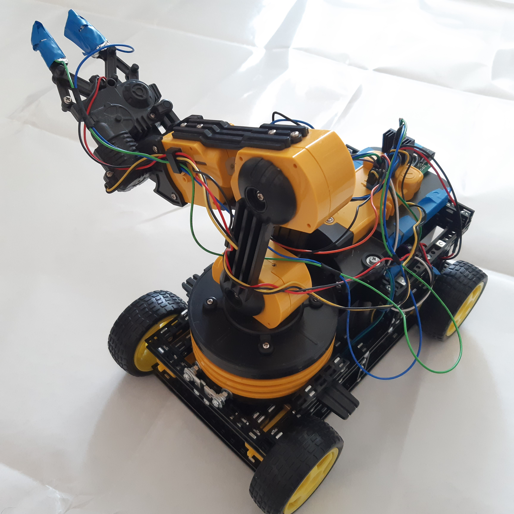

# Závěr Ročníku 2022
Na robotový po softwarové stránce je vždy co děla.
Hardwarové jsem narazil na slabinu propojováních kabelů, které sem na vše použil. Problém byl s špatnými kontakty, tak i s vyhořením kabelu při proudových špičkách.

# Cíl na další rok
Doladit/překopat webové ovládaní.
Vytvořit plošný spoj.

# Fotky soutěžního robota

# BuckysPlasticArm
Kategorie: Toy Cleanup Beginner
BuckysPlasticArm je robot, ve kterém jsem použil Robotické rameno KSR10. Přidal jsem k němu podvozek z Totemu a řídicí elektroniku. Hmotnost je 1,5kg. Robot zažil hned několik změn konceptů. Některé se dostaly i do gitu: https://github.com/PNmJunior/RB2022-TymRECYLKON-TCB-BuckysPlasticArm.git Posledním konceptem je, že v podvozku je dobíjecí baterie z notebooku a v původním prostoru pro baterie je elektronika. 
Původně jsem chtěl robota ovládat pomocí Bluetooth a mnou naprogramované mobilní aplikace. S tímto způsobem jsem ale měl špatné předchozí zkušenosti a tak jsem se rozhodl vyřešit to lépe. Zrušil jsem aplikaci, konstrukčně vyřešil bezdrátové bootování a řídil to pomocí webového prohlížeče. Kvůli použitým propojovacím kabelům k elektrickému propojení, jsem musel nadzvednout horní stranu krabičky o 2 centimetry, čímž jsem vyřešil i problém s chlazením.

