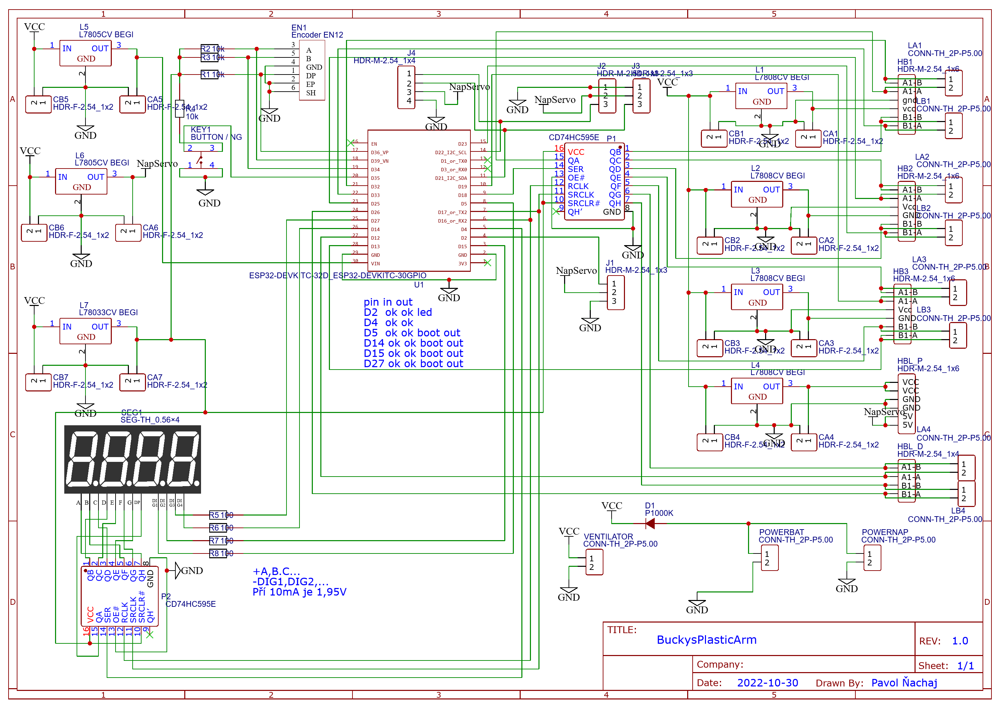
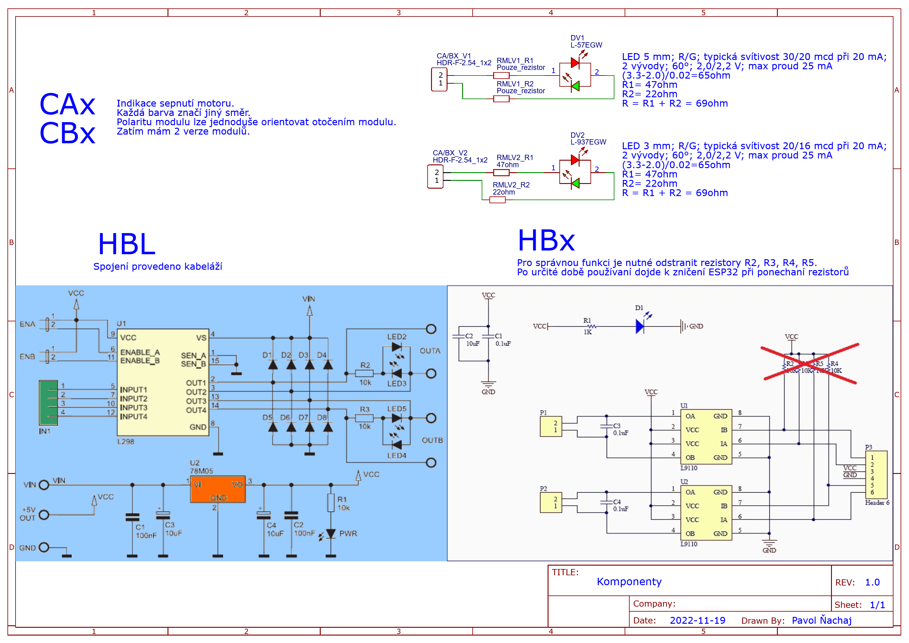
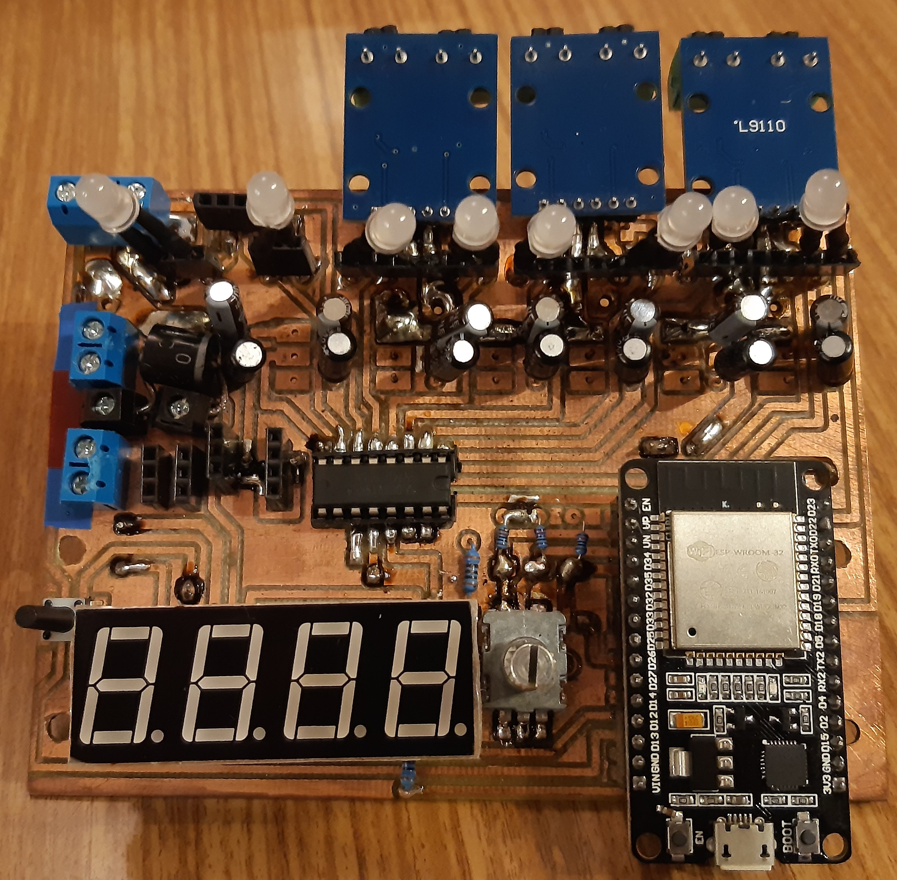
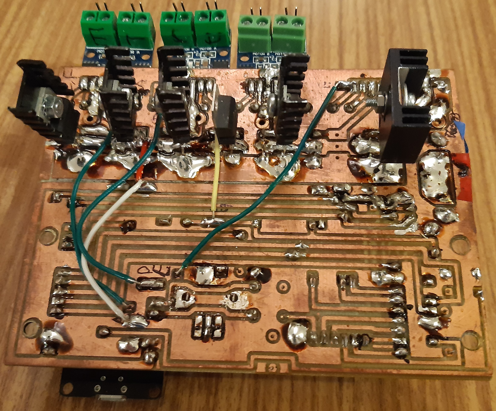

# Schéma
Pro tvorbu Schémy a PCB jsem použil [EasyEDA]https://easyeda.com/).

Kompletní schéma je zde:

A komponenty:

Ovladač:

# PCB

Pro výrobu PCB jsem použil návrh s názvem "PCB vyroba".

Šlo o prototyp, a tak jsem zde měl několik chyb. Zapomněl jsem svorku pro vypínač. A potom několik kosmetických záležitostis. Částečně opravenou verze mám pod názvem "PCB uprava1".

Fotka PCB zhora

Fotka PCB zdola

# Úpravy

Místo ochranné diody jsem umístil svorkovnici, kde umístím obvod, kde v sérii bude dioda a vypínač. Zatím je zde pouze dioda.

Chybí zde HBL (modul s L298N) pro řízení podvozku.